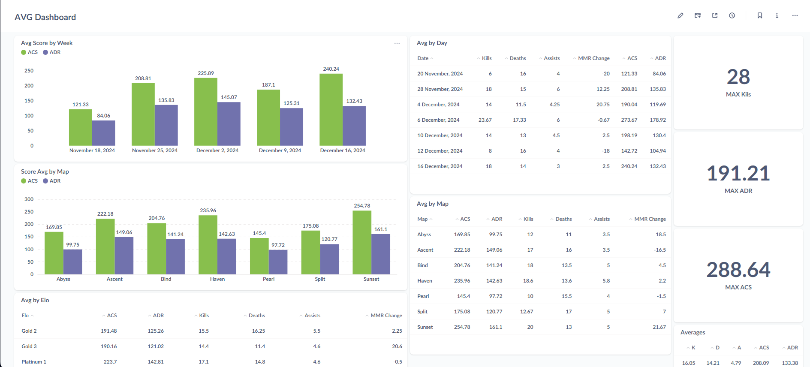
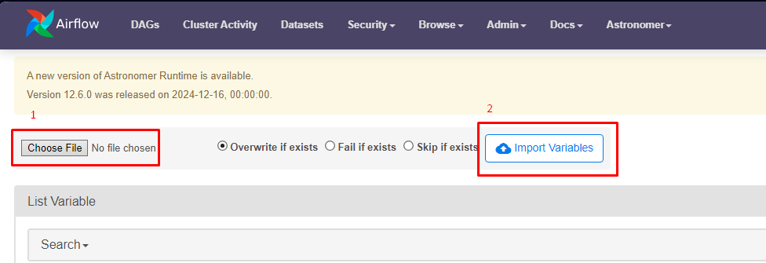
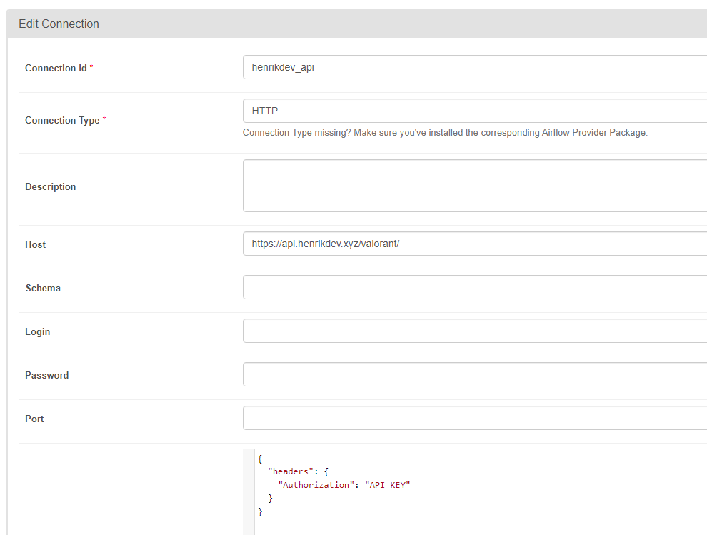
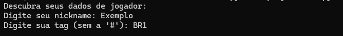
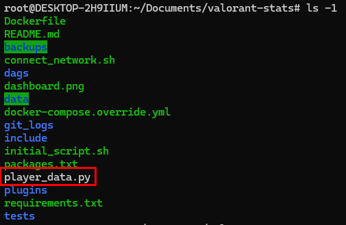

# 📊 Valorant Stats 

Valorant Stats é um projeto pessoal que utiliza o Apache Airflow para agendar e automatizar a coleta de estatísticas das partidas rankeadas do meu perfil no Valorant. O objetivo principal do projeto é praticar habilidades em orquestração de workflows e automação de processos, enquanto analiso dados relevantes que possibilitam uma melhora de desempenho em meu hobbie.



## ⚙️ Tecnologias Utilizadas

- Apache Airflow
- Docker
- Python
- Django
- PostgreSQL
- HenrikDEV API
- Metabase
- Minio

## ✨ Funcionalidades

- Coleta automática das estatísticas das partidas rankeadas.
- Agendamento de tarefas recorrentes para atualização de dados.
- Organização e armazenamento dos dados em um banco estruturado.
- Visualização de estatísticas relacionadas ao desempenho no jogo.
## Requisitos ✅

Ferramentas necessárias para executar o projeto:

- [🐳 **Docker**](#-como-instalar-o-docker)

- [💻 **Astro**](#-como-instalar-o-astro-cli)
## 🚀 Como executar o projeto

#### 1. Clone este repositório:

```
git clone git@github.com:carlosdamaia/valorant-stats.git
```

#### 2. Acesse a pasta do projeto:
```
cd valorant-stats/
```

#### 3. Execute o script `gen_fernetkey.py` antes de iniciar o projeto:

```
python3 gen_fernetkey.py
```

#### 4. Dentro do repositório local, inicie o ambiente:

```
astro dev start
```

#### 5. Execute o script `initial_script.sh`:

```
./initial_script.sh
```

#### 6. Importar o arquivo JSON na [UI do Airflow](http://localhost:8080/variable/list/) na sessão Admin ➤ Variables. O arquivo se encontra em `valorant-stats/admin-data/variables.json`. Você pode [editar as variáveis dos dados do jogador](#-como-integrar-dados-de-um-jogador) diretamente na UI ou editar o arquivo antes de importar.



#### 7. Adicionar a conexão com a API na sessão Admin ➤ Connections na UI do Airflow seguindo o arquivo JSON `valorant-stats/admin-data/connections.json`.



**OBS: será necessário criar e incluir uma API KEY própria na conexão com a API, [crie uma aqui](https://docs.henrikdev.xyz/authentication-and-authorization).**

Já é possível [**acessar as ferramentas do projeto**](#-acesso-as-ferramentas)!
## 🔒 Acesso as ferramentas

| **Ferramenta**  | **Link** | **Usuário** | **Senha** |
| --------------- | :--------: | ----------- | --------- |
| Airflow | [↗️ http://localhost:8080/](http://localhost:8080/) | admin | admin
| Metabase | [↗️ http://localhost:3000/](http://localhost:3000/) | criar conta | criar conta |
| Postgres | [↗️ http://localhost:5432/postgres](http://localhost:5432/postgres) | postgres | postgres |
| Minio | [↗️ http://localhost:9000](http://localhost:9000) | minio | minio123 |


## ⚡ Como integrar dados de um jogador

Para coletar os dados das partidas de um jogador específico, é necessário alterar as seguintes variáveis dentro da UI do Airflow:

- **TAG**
- **NAME**
- **PUUID**

Para isso, no menu superior da aplicação acesse **Admin** ➤ **Variables** e edite as variáveis mencionadas acima.

[**Clique aqui**](#-como-descobrir-puuid-do-jogador) caso você não saiba o **PUUID** do seu jogador.


## 📚 Apêndice

- ### 🐳 Como instalar o Docker

    #### 1. 

    ```
    # Add Docker's official GPG key:
    sudo apt-get update
    sudo apt-get install ca-certificates curl
    sudo install -m 0755 -d /etc/apt/keyrings
    sudo curl -fsSL https://download.docker.com/linux/ubuntu/gpg -o /etc/apt/keyrings/docker.asc
    sudo chmod a+r /etc/apt/keyrings/docker.asc

    # Add the repository to Apt sources:
    echo \
    "deb [arch=$(dpkg --print-architecture) signed-by=/etc/apt/keyrings/docker.asc] https://download.docker.com/linux/ubuntu \
    $(. /etc/os-release && echo "$VERSION_CODENAME") stable" | \
    sudo tee /etc/apt/sources.list.d/docker.list > /dev/null
    sudo apt-get update
    ```

    #### 2.
    ```
    sudo apt-get install docker-ce docker-ce-cli containerd.io docker-buildx-plugin docker-compose-plugin
    ```

    ↗️ **[Documentação oficial](https://docs.docker.com/engine/install/ubuntu/) 📖**

- ### 💻 Como instalar o Astro CLI

    #### 1.
    ```
    curl -sSL install.astronomer.io | sudo bash -s
    ```

    #### 2.
    ```
    astro version
    ```

    Se a instalação estiver correta, a versão do Astro CLI será exibida no terminal:

    ```
    Astro CLI Version: 1.30.0
    ```

    ↗️ **[Documentação oficial](https://www.astronomer.io/docs/astro/cli/install-cli/?tab=linux#install-the-astro-cli) 📖**

- ### 🆔 Como descobrir PUUID do jogador

    #### 1. Execute o script `player_data.py` dentro da pasta inicial do projeto:

    ```
    python3 player_data.py
    ```

    **OBS: para que o script funcione, você deve ter um arquivo `.env` no diretório deste repositório com a variável `API_KEY` preenchida com sua key da API. [Clique aqui](https://docs.henrikdev.xyz/authentication-and-authorization) para registrar uma API Key própria.**

    #### 2. Insira os dados solicitados.

    

    #### 3. O arquivo com todos os dados da conta do jogador foram salvos no arquivo `player_data.json`

    
